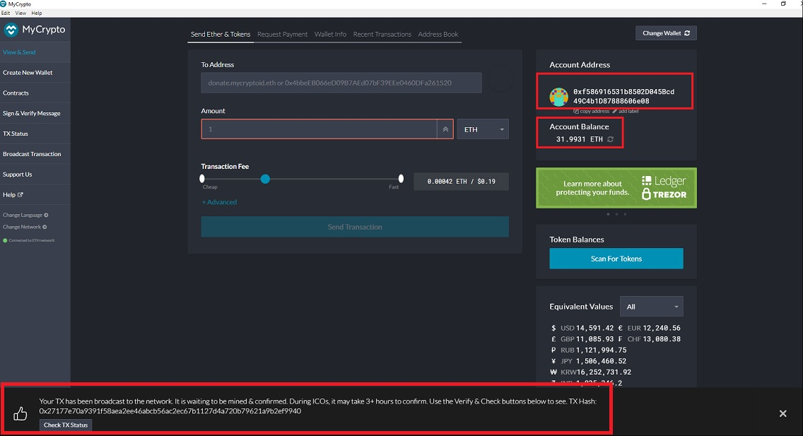
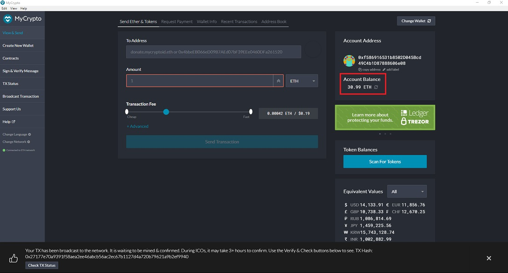
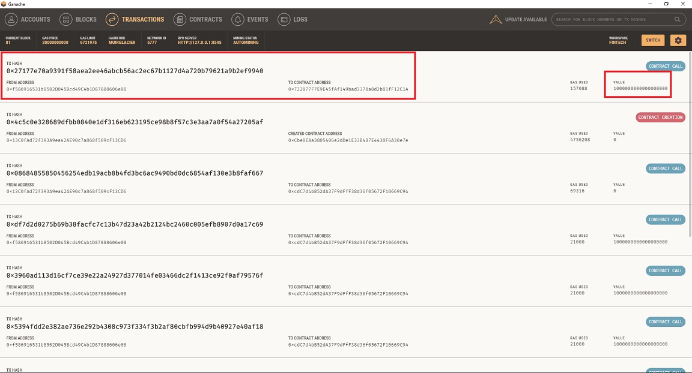
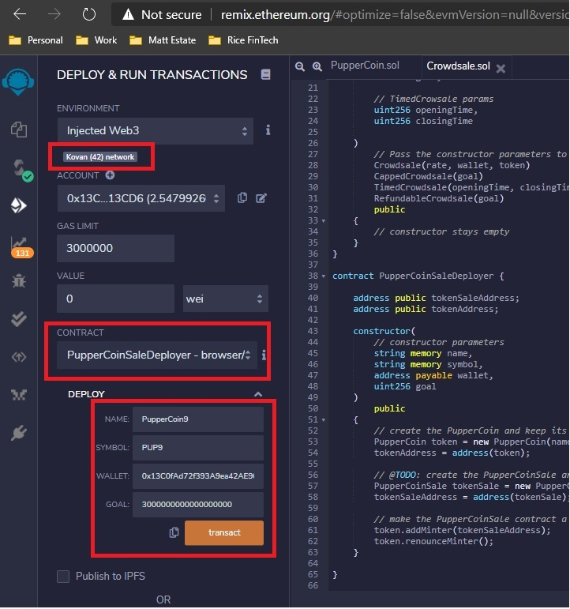
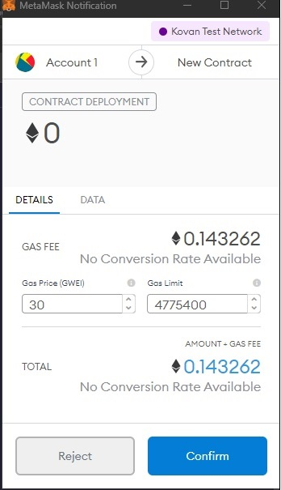

# 21-Advanced-Solidity

#### Unit 21 Advanced Solidity Homework - Dan Smith  
* PupperCoin Crowdsale Deployer and Sale solidty contract code: [Crowdsale.sol](./Crowdsale.sol)
* PupperCoin solidty contract code: [PupperCoin.sol](./PupperCoin.sol)

##### Testing:
1. Sending 1 ETH to purchase PupperCoin from MyCrypto:  

    > 
    > 
    > 

2. Deployment to Kovan Test Network:  
  * PupperCoinSaleDeployer Address: [0xAb51c7F0979a1C6C84AC112246FEE28DC8F72f47](https://kovan.etherscan.io/address/0xAb51c7F0979a1C6C84AC112246FEE28DC8F72f47)  
  * PuperCoinSale Address: [0x49c104c3087f3fF50d6e933e647EFECc5F1A1A72](https://kovan.etherscan.io/address/0x49c104c3087f3ff50d6e933e647efecc5f1a1a72)  
  * Wallet (contract creator): [0x13C0fAd72f393A9ea42AE90c7a868f509cF13CD6](https://kovan.etherscan.io/address/0x13C0fAd72f393A9ea42AE90c7a868f509cF13CD6)  
  * Address of token buyer (1 ETH): [0xf586916531b8502D045Bcd49C4b1D87888606e08](https://kovan.etherscan.io/address/0xf586916531b8502D045Bcd49C4b1D87888606e08)  
  
    > 
    > 
